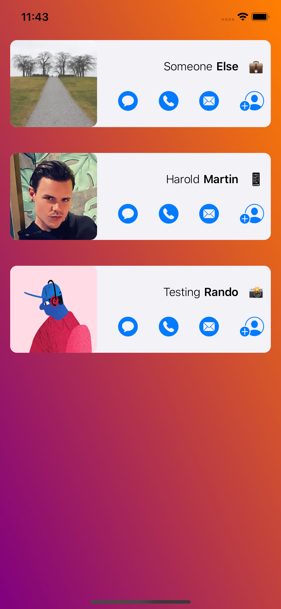
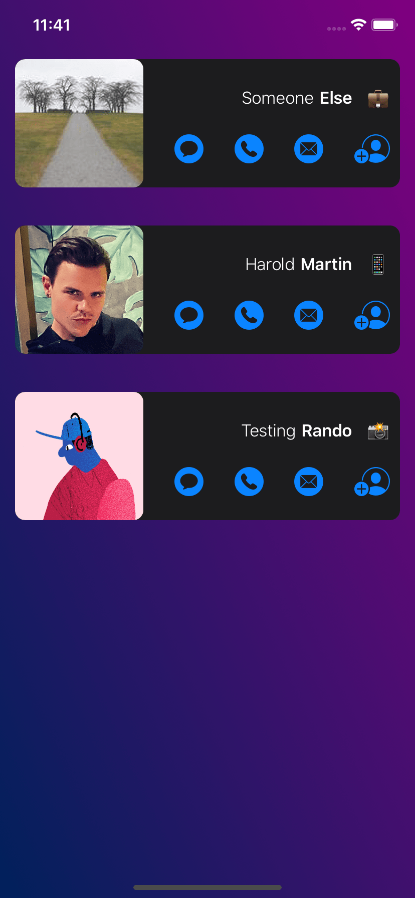

# Directory-SwiftUI

A directory demo app written with SwiftUI, Core Data, and Alamofire

## Getting Started
1. Clone (or fork) this repo: ``git clone git@github.com:hbmartin/Directory-SwiftUI.git``
2. Open ``Directory.xcworkspace`` in XCode
3. Build and run!

### Additional tooling:
* Install [SwiftLint](https://realm.github.io/SwiftLint/) with ``brew intall swiftlint`` for command line linting
* [Pods](https://cocoapods.org/) are committed in the repo, but can be reinstalled ``pod install``
* Install [gyb](https://nshipster.com/swift-gyb/) with ``brew install nshipster/formulae/gyb`` and follow the steps in [Secrets.swift](https://github.com/hbmartin/Directory-SwiftUI/blob/master/Directory/Data/Secrets.swift) for securing API keys

## Built With

* [Sync](https://github.com/3lvis/Sync) - Keep Core Data updated with API result
* [Kingfisher](https://github.com/onevcat/Kingfisher) - Image loading and caching
* [Shift](https://github.com/andre991/Shift) - Animated background gradient
* [Alamofire](https://github.com/Alamofire/Alamofire) - Network API request
* [SFSafeSymbols](https://github.com/piknotech/SFSafeSymbols) - Static typed access to SF Symbols
* [SwiftLint](https://realm.github.io/SwiftLint/) - Enforce Swift style and conventions

## Contributing

[Open an issue](https://github.com/hbmartin/Directory-SwiftUI/issues/new) to report bugs or make feature requests. Pull requests are very welcome! For major changes, please open an issue first to discuss what you would like to change.

### Code Formatting

This project uses [SwiftLint](https://realm.github.io/SwiftLint/) with rules configured in [.swiftlint.yml](https://github.com/hbmartin/Directory-SwiftUI/blob/master/.swiftlint.yml)

### Code of Conduct

Treat other people with helpfulness, gratitude, and consideration! See the [Python Community Code of Conduct](https://www.python.org/psf/codeofconduct/).

## Authors

* [Harold Martin](https://www.linkedin.com/in/harold-martin-98526971/) - harold.martin at gmail

## License

[Apache License 2.0](LICENSE.txt)
